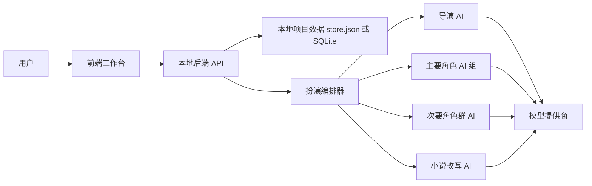
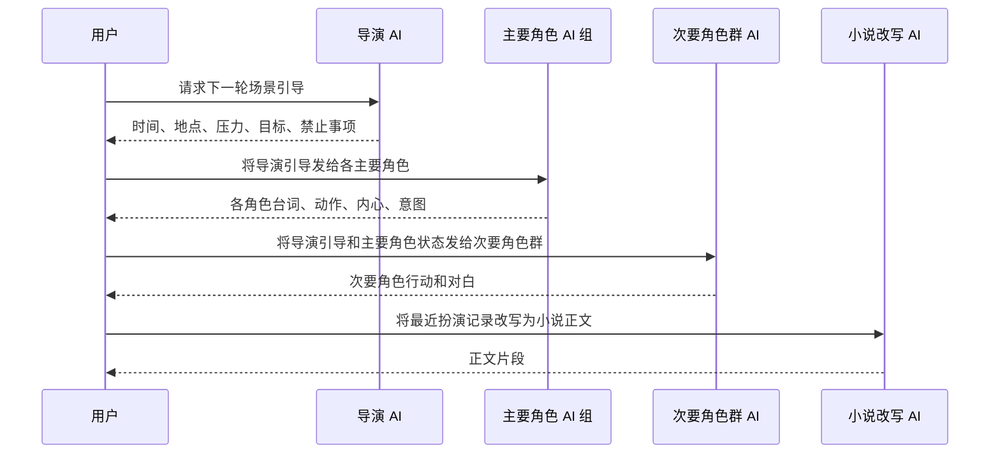

# 扮演法写小说项目详细设计

## 1. 设计前判断

用户思路整体可实现，而且价值明确：它把“写小说”拆成“前期策划沉淀档案”“角色在场景中做选择”“把选择改写成正文”三个阶段，有机会比单次提示词直接生成小说更稳定。

但这个方案也有几个必须正视的问题：

1. 多 AI 扮演会明显增加成本和延迟。主要角色越多，一轮扮演调用次数越多，必须支持手动控制、分轮推进和局部重跑。
2. 角色分开扮演会带来冲突。每个角色只知道自己的动机，可能同时抢主导权，所以需要“导演 AI”只负责场景约束和冲突整理，而不是直接替角色决定。
3. 次要角色共用一个 AI 是合理的，但它不能被设计成“随便补充群众对白”的工具。它应该是一个“次要角色群演员”，只在本轮被导演允许时出场。
4. 最终改写 AI 容易篡改角色选择。必须把改写器约束为“忠实改写”，不能让它重写情节。
5. 酒馆和角色卡的核心价值不在界面，而在提示词结构。角色卡字段要服务于角色稳定性，而不是为了字段完整而堆表单。
6. 如果打开小说后直接进入配置表单，用户会被迫先调参数而不是创作。正确入口应该是 AI 策划交互，再从交互中提取角色卡、背景、大纲、场景和线索。
7. 扮演法不应该覆盖整个创作流程。它适合具体行文阶段，前期更适合用策划助手和档案系统反复澄清。
8. AI 策划不应该被做成“聊天框旁边放一个提取按钮”。更准确的形态是：一个线程式 Agent 工作台，并强制挂载小说策划 skill。用户不断补充灵感或长文档，Agent 在自然对话中规划、检索、调用工具、沉淀档案和检查冲突。

## 2. 核心目标

项目要解决的核心问题：

1. 能创建和管理多个小说项目。
2. 打开小说后默认进入 AI 策划交互页面。
3. AI 策划助手能通过挂载策划 skill 的持续对话检索项目资料、当前小说 Agent 工作区和额外资料文件夹，提取并拟定角色卡、背景、大纲、场景和线索。
4. 能把策划结果保存为结构化档案。
5. 能由策划 Agent 根据档案、角色卡、世界书、长期记忆和 RAG 检索证据生成扮演配置草案。
6. 用户可以直接采纳草案，也可以人工修改后再启动扮演。
7. 每个主要角色可以单独选择提供商和模型进行扮演。
8. 次要角色可以共同使用一个 AI 扮演。
9. 背景、时间、地点、剧情引导由单独 AI 负责。
10. 扮演过程可由前端控制，按轮推进。
11. 扮演记录可以被改写 AI 转成小说正文片段。
12. 提供商配置支持 `baseUrl`、`key`、`responses` 或 `chat/completions`、模型查询和手动添加模型。

非目标：

1. 第一阶段不做全自动长篇生成。必须先保证每轮扮演可控。
2. 第一阶段不做复杂视觉编辑器。前端先服务编排、配置和结果审阅。
3. 第一阶段不依赖某个固定模型厂商。接口以 OpenAI 兼容形态为中心。
4. PNG 角色卡元数据、独立世界书和基础记忆组包已经进入第一版；第一阶段不追求完整复刻酒馆所有扩展字段，也不强依赖外部向量数据库。

## 3. 酒馆与角色卡转化原则

参考资料见 [research.md](./research.md)。
skill 与插件写法见 [skill_plugin_design.md](./skill_plugin_design.md)。

酒馆类应用常见结构可以抽象为：

1. 角色卡：角色名称、描述、性格、场景、首条消息、示例对话、系统提示、历史后置指令、标签、世界书。
2. 世界信息：背景设定、地点、势力、规则、常识、隐秘信息。
3. 聊天历史：角色与用户之间的上下文。
4. 生成设置：模型、温度、上下文长度、停止词等。

本项目不照搬“用户和单角色聊天”的形态，而是把角色卡改造成“演员 Agent 的稳定人格输入”。

策划阶段采用应用内 skill 包，而不是把某个 `SKILL.md` 原样塞进模型上下文。当前落地位置是 `server/skillpacks/novel-planning.js`，它负责生成策划对话、档案提取和扮演配置三类提示词，并把酒馆 V2 字段映射到本项目角色卡。策划 skill 现在还强制输出 `archiveDiagnostics`，用于记录素材类型、候选提取、写入决策、冲突、纠错、待确认内容和档案缺口。

角色卡字段建议：

| 字段 | 用途 |
| --- | --- |
| `name` | 角色名，用于提示词身份锁定 |
| `roleType` | `major` 或 `minor`，决定调用方式 |
| `description` | 外部可观察信息，减少角色外貌和身份漂移 |
| `personality` | 角色行动倾向，不直接等于标签 |
| `motivation` | 长期欲望或缺口，后续建议加入 |
| `relationshipMap` | 与其他角色的关系，后续建议加入 |
| `scenario` | 角色当前处境 |
| `firstMessage` | 角色初始语气样本 |
| `exampleDialog` | 示例对话，稳定说话方式 |
| `systemPrompt` | 角色专属硬约束 |
| `postHistoryInstructions` | 压在历史之后的补充提醒 |
| `lorebook` | 角色相关世界信息 |
| `tags` | 检索和分组 |

设计上不要无限增加状态字段。记忆能力采用“稳定档案 + 世界书触发 + 结构化记忆 + 检索证据 + 最近上下文”的统一组包，而不是在角色上堆几十个布尔状态。

## 4. 总体架构

建议采用本地 Web 工作台：



第一阶段可用 `Node.js + 原生 HTTP + 原生前端` 快速跑通闭环。  
第二阶段如果功能变复杂，再迁移到 `React/Vue + SQLite + 类型校验`。

原因：

1. 当前目标更依赖编排正确性，不依赖复杂 UI 技术。
2. 本地后端可以保护 key，不让浏览器直接持有完整密钥。
3. 原型阶段减少依赖，避免把时间花在框架配置上。
4. 数据模型稳定后，再升级技术栈更稳。

## 5. 核心领域模型

### 5.1 Novel

小说项目是顶层容器。

```json
{
  "id": "novel_xxx",
  "title": "小说名",
  "scenario": {
    "background": "世界背景",
    "time": "当前时间",
    "place": "当前地点",
    "plotDirection": "剧情方向",
    "tone": "叙事基调"
  },
  "archives": {},
  "planning": {},
  "characters": [],
  "aiRoles": {},
  "session": {}
}
```

### 5.2 Character

角色卡是稳定人格和剧情身份的来源。

```json
{
  "id": "char_xxx",
  "roleType": "major",
  "name": "角色名",
  "description": "可观察描述",
  "personality": "性格和行动倾向",
  "scenario": "角色当前处境",
  "firstMessage": "首条消息样本",
  "exampleDialog": "示例对话",
  "systemPrompt": "角色硬约束",
  "postHistoryInstructions": "历史之后的提醒",
  "lorebook": "角色专属世界信息",
  "tags": []
}
```

### 5.3 AgentSlot

不要为导演、演员、改写器分别设计完全不同的数据结构。它们都可以抽象为 Agent 槽位。

```json
{
  "id": "slot_xxx",
  "kind": "planner | guide | major_actor | minor_actor_pool | adapter",
  "targetId": "角色 id 或空",
  "providerId": "provider_xxx",
  "model": "模型名",
  "temperature": 0.8,
  "enabled": true
}
```

这样的好处：

1. 统一配置提供商和模型。
2. 未来可以增加“审稿 AI”“连续性检查 AI”“世界书检索 AI”，不用重写配置体系。
3. 可以支持一个角色多个模型版本对比。

### 5.4 Provider

```json
{
  "id": "provider_xxx",
  "name": "OpenAI 或本地代理名",
  "baseUrl": "https://api.example.com/v1",
  "endpointKind": "responses | chat_completions",
  "modelQueryPath": "/models",
  "apiKey": "本地保存，不完整回显",
  "models": []
}
```

### 5.5 Archives

档案是 AI 策划交互的沉淀结果，不等于最终正文，也不等于本轮扮演配置。

```json
{
  "premise": "核心命题",
  "background": "世界背景",
  "outline": "大纲或下一阶段剧情方向",
  "style": "叙事基调或文风偏好",
  "characters": [],
  "scenes": [],
  "clues": []
}
```

设计重点：

1. `archives` 允许 AI 持续提取和合并，而不是一次性填完。
2. 用户可以通过多轮对话或长文档输入不断补充材料，后端把每轮 `archivePatch` 合并进档案。
3. 角色、场景、线索先用灵活数组保存，避免过早固化字段。
4. 进入行文阶段时，再把档案转成可执行的角色卡和扮演配置。

### 5.6 Planning

策划过程保存对话和扮演配置草案。

```json
{
  "messages": [],
  "roleplayDrafts": []
}
```

`messages` 保存用户和策划助手的交互；每轮交互都按“理解输入、自然回复、检索证据、工具执行、必要写入、观察回传、继续修正或收束”的策划 Agent 流程运行。`roleplayDrafts` 保存 AI 根据档案生成的扮演配置草案。用户可以直接采纳，也可以修改后采纳。`defaultRoleplayConfig` 保存这本书最近一次成功保存 / 应用的扮演配置，作为后续默认基线；单纯生成草案不会刷新默认配置。

策划 Agent 的工具层采用后端注册表，而不是把按钮硬塞进前端。注册表向模型和前端同时暴露工具名称、风险、分类、严格 JSON schema、原生 `tool_calls` function 定义和可用状态。当前文件工具包括 `readFile`、`writeFile`、`previewPatchFile`、`patchFile`、`revertFilePatch`：预览只返回 unified diff 和 hash；写入和补丁会生成 `patchId` 并保存历史；回滚会检查当前文件 hash，防止覆盖用户后续手改。联网搜索工具 `webSearch` 支持 provider、缓存、失败重试、来源可信度和 URL 引用字段。Shell 工具分为一次性命令、持续会话和后台作业三层：后台作业支持 start/list/read/stop，适合长时间资料处理或测试服务，但仍受命令前缀授权、目录权限和危险命令拦截约束。

权限分两层：全局模式决定只读、低风险自动编辑、高风险询问或全自动；细粒度策略可以按目录、命令前缀、工具、session grant 和 persistent grant 设置 `allow`、`confirm`、`deny`。默认不会开放工作区外读写和 shell；即使后续接入持续 shell、后台进程或 MCP，也必须先通过这层权限策略注册和审批。

### 5.7 Session

扮演过程建议采用事件日志，而不是只保存最终文本。

```json
{
  "turnIndex": 3,
  "events": [],
  "turns": [],
  "proseParts": [],
  "prewritePlan": {},
  "reviews": [],
  "chapterWorkflows": []
}
```

事件日志可以保存：

1. 导演引导生成。
2. 某个角色完成扮演。
3. 次要角色群完成扮演。
4. 用户手动编辑某条扮演记录。
5. 改写器生成正文。
6. 用户采纳、废弃或重写正文。
7. 章节工作流步骤推进。
8. 上下文审计和写后回写状态。

### 5.8 ChapterWorkflow

章节工作流是具体行文阶段的最小闭环，不是全书自动化任务。它把一次章节推进中的写前定位、上下文包、扮演轮次、审查、正文草稿和写后回写绑定到同一组可追踪产物。

```json
{
  "id": "workflow_xxx",
  "chapterLabel": "第一章",
  "status": "draft | planning | roleplaying | reviewing | adapting | postwriting | completed | blocked",
  "intent": "本章目标",
  "prewritePlanId": "prewrite_xxx",
  "turnIds": ["turn_xxx"],
  "proseIds": ["prose_xxx"],
  "reviewIds": ["review_xxx"],
  "contextAudits": [],
  "writeBack": {},
  "steps": {
    "prewrite": {},
    "context": {},
    "roleplay": {},
    "review": {},
    "adapt": {},
    "postwrite": {}
  }
}
```

设计边界：

1. 写前定位由导演 AI 负责，只做本章职责、档案调用摘录、前台锚点、后台不出句、段落组计划和软边界。
2. 角色上下文审计保存摘要，不把完整大上下文复制到工作流里；完整包仍在 `turn.memoryInjection`、`prose.memoryInjection` 或上下文资产中追踪。
3. 写后回写只允许处理已采纳正文，不能把未确认草稿沉淀成长期记忆。
4. 指定 `workflowId` 的章节工具必须只使用该工作流内的写前定位、扮演轮次、审查和正文草稿；如果目标工作流没有扮演轮次，改写会直接阻断，避免跨章节串线。
5. 一轮扮演完成后会自动审查；章节工作流继续跑到 `review` 步时默认复用已有审查，只有显式 `forceReview` 才重新审查。
4. `chapterWorkflows` 会投影到每本书自己的 `roleplay-novel-project/session/` 目录，方便 Agent 像读项目文件一样检索。

## 6. 扮演流水线

具体行文按章节工作流推进，完整链路是：


一轮扮演内部仍分四步：



实际实现中，前端应提供两种控制方式：

1. 分步执行：先导演，再主要角色，再次要角色，再改写。
2. 一键执行一轮：适合配置稳定后快速推进。

当前实现已经支持章节工作流的一键“运行到正文草稿”，也保留分步按钮。单角色重跑已落地：只替换指定主要角色输出，并刷新该角色上下文审计和后续审查。

## 7. 各类 Agent 设计

### 7.1 导演 AI

职责：

1. 给出本轮时间、地点、现场状态。
2. 给出本轮剧情目标。
3. 给出场景压力和冲突源。
4. 给出禁止事项，避免角色越界。
5. 不替任何主要角色做决定。

推荐输出结构：

```json
{
  "time": "傍晚",
  "place": "旧车站候车厅",
  "scene_goal": "让角色发现失踪线索",
  "pressure": "外面暴雨封路，站内广播反复播报错误班次",
  "available_facts": ["候车厅有旧储物柜", "站务员认识失踪者"],
  "forbidden_moves": ["不能直接揭晓幕后黑手", "不能让主角突然获得未铺垫能力"],
  "director_note": "本轮重点是试探和误会"
}
```

### 7.2 主要角色 AI

职责：

1. 只扮演自己。
2. 输出台词、动作、内心、当下意图。
3. 不替其他主要角色做决定。
4. 不直接写小说正文。
5. 必须遵守导演 AI 的场景边界。

推荐输出结构：

```json
{
  "speech": "角色说的话",
  "action": "角色做的动作",
  "inner_thought": "角色内心",
  "intention": "角色当下想达成什么",
  "needs_response_from": ["另一个角色名"],
  "continuity_note": "和前文连续性有关的信息"
}
```

### 7.3 次要角色群 AI

职责：

1. 统一扮演所有次要角色。
2. 只让本轮需要出现的次要角色行动。
3. 通过信息、阻碍、误会、氛围推动场景。
4. 不抢主要角色的核心选择。

推荐输出结构：

```json
{
  "minor_actions": [
    {
      "name": "站务员",
      "speech": "你们最好别碰那个柜子。",
      "action": "他把钥匙串攥进掌心。",
      "purpose": "制造阻碍并暗示储物柜重要"
    }
  ]
}
```

### 7.4 小说改写 AI

职责：

1. 把扮演记录改写成小说正文。
2. 保留角色选择，不新增关键设定。
3. 处理对白、动作、心理和环境的叙事顺序。
4. 根据小说基调调整语言。

禁止：

1. 不允许把 JSON 痕迹写进正文。
2. 不允许让角色突然知道自己不该知道的信息。
3. 不允许为了顺滑而删除关键冲突。

## 8. 前端功能设计

### 8.1 页面结构

新版采用侧栏 + 多页面结构，而不是把所有模块塞进三栏。

页面：

1. 小说库：新建、打开、删除小说。
2. 策划 Agent：打开小说后的默认页面，通过对话、检索和工具调用沉淀档案。
3. 档案：查看和人工修正背景、大纲、角色、场景、线索。
4. 扮演配置：AI 生成扮演草案，用户采纳或修改后采纳。
5. 行文：运行扮演、改写正文、查看记录。
6. 提供商：配置模型提供商和模型列表。

### 8.2 小说管理

功能：

1. 新建小说。
2. 删除小说。
3. 打开小说。
4. 修改小说标题。
5. 打开小说后默认进入 AI 策划页。

### 8.3 AI 策划与档案

功能：

1. 前端呈现为线程式 Agent 工作台，而不是字段表单或普通聊天窗口。
2. 用户通过对话输入灵感，也可以粘贴大段设定、旧大纲、章节片段或人物关系文档。
3. 策划助手 AI 被强制挂载为小说策划 skill，先理解输入，再做素材分类、上下文检索、候选提取和冲突校验。
4. 策划助手 AI 同时返回 `archivePatch` 和 `archiveDiagnostics`；后端只把满足写入合同的稳定内容合并进档案，诊断用于审查和纠错。
5. 提取档案、更新记忆、更新世界书和准备扮演配置都由策划 Agent 通过 `skillOps` 工具调用完成，不再依赖策划页外部流程按钮。
6. 用户可在策划线程中查看检索上下文、工具审计、运行历史和 checkpoint；回到某条用户任务应是消息旁操作。
7. 档案页支持人工修正。

### 8.4 扮演配置

功能：

1. 策划 Agent 根据档案、角色卡、世界书、长期记忆和 RAG 检索证据生成扮演配置草案。
2. 用户可直接采纳草案。
3. 用户可修改 JSON 后采纳。
4. 用户可采纳并直接启动扮演。
5. 管理策划助手、导演、次要角色群、改写器的模型配置。
6. 添加、编辑、删除实际参与扮演的角色卡。

注意：次要角色如果也逐个配置模型，会背离用户原始思路，并显著增加调用成本。第一阶段不建议做。

### 8.5 提供商管理

功能：

1. 添加提供商。
2. 编辑提供商名称、baseUrl、接口类型、key。
3. 查询模型。
4. 手动添加模型。
5. 删除模型。
6. 删除提供商。

安全策略：

1. 前端不显示完整 key。
2. key 只由本地后端保存。
3. 如果后续支持远程部署，必须改为服务端密钥管理或用户本地代理。

### 8.6 行文控制

功能：

1. 用步骤条展示写前定位、上下文、扮演、审查、改写、回写。
2. 运行完整章节链路到正文草稿。
3. 分步生成写前定位、运行扮演、审查、改写。
4. 查看每个角色上下文审计，包括触发世界书、长期记忆和 RAG 证据。
5. 单角色重跑。
6. 采纳正文后执行写后回写。
7. 清空当前扮演会话。

## 9. 后端接口设计

### 9.1 状态

| 方法 | 路径 | 说明 |
| --- | --- | --- |
| `GET` | `/api/state` | 获取全部前端状态，key 脱敏 |

### 9.2 小说

| 方法 | 路径 | 说明 |
| --- | --- | --- |
| `POST` | `/api/novels` | 新建小说 |
| `POST` | `/api/active-novel` | 切换当前小说 |
| `PATCH` | `/api/novels/:id` | 更新小说标题、场景、AI 槽位、档案 |
| `DELETE` | `/api/novels/:id` | 删除小说 |

### 9.3 策划与档案

| 方法 | 路径 | 说明 |
| --- | --- | --- |
| `POST` | `/api/novels/:id/planning-chat` | 向策划助手发送消息，并合并返回的档案补丁 |
| `GET` | `/api/novels/:id/planning-messages?beforeId=&limit=` | 分页读取策划线程历史消息；前端上滑时静默补载 |
| `POST` | `/api/novels/:id/extract-archives` | 从策划对话重新整理档案，用于修正历史对话沉淀结果 |
| `POST` | `/api/novels/:id/generate-roleplay-config` | 根据档案生成扮演配置草案 |
| `POST` | `/api/novels/:id/apply-roleplay-config` | 采纳草案或用户修改后的配置，可选择采纳后立即启动扮演 |

### 9.4 角色

| 方法 | 路径 | 说明 |
| --- | --- | --- |
| `POST` | `/api/novels/:id/characters` | 添加角色 |
| `PUT` | `/api/novels/:id/characters/:characterId` | 更新角色卡 |
| `DELETE` | `/api/novels/:id/characters/:characterId` | 删除角色 |

### 9.5 提供商

| 方法 | 路径 | 说明 |
| --- | --- | --- |
| `POST` | `/api/providers` | 新增或更新提供商 |
| `DELETE` | `/api/providers/:id` | 删除提供商 |
| `POST` | `/api/providers/:id/models/query` | 查询模型 |
| `POST` | `/api/providers/:id/models` | 手动添加模型 |
| `POST` | `/api/providers/:id/models/remove` | 删除模型 |

### 9.6 扮演

| 方法 | 路径 | 说明 |
| --- | --- | --- |
| `POST` | `/api/novels/:id/run-turn` | 运行下一轮扮演 |
| `POST` | `/api/novels/:id/adapt` | 将最近扮演改写为正文 |
| `GET` | `/api/novels/:id/chapter-workflow` | 查询当前章节工作流、步骤、上下文审计和相关产物 |
| `POST` | `/api/novels/:id/chapter-workflow/run` | 串行运行写前定位、扮演、审查、改写、可选写后回写 |
| `POST` | `/api/novels/:id/reset-session` | 清空当前会话 |
| `PUT` | `/api/novels/:id/prose/:proseId` | 编辑正文片段 |
| `POST` | `/api/novels/:id/prose/:proseId/accept` | 采纳正文片段，并触发写后回写 |
| `POST` | `/api/novels/:id/prose/:proseId/postwrite` | 对已采纳正文重新执行写后回写 |
| `POST` | `/api/novels/:id/prose/:proseId/discard` | 废弃正文片段，并让同源记忆过期 |

### 9.7 记忆

| 方法 | 路径 | 说明 |
| --- | --- | --- |
| `GET` | `/api/novels/:id/context-pack?task=director&characterId=` | 预览某类 AI 本轮会收到的上下文包 |
| `POST` | `/api/novels/:id/memory/rebuild` | 清理旧版机械投影记忆，并保留明确沉淀的长期事实 |
| `POST` | `/api/novels/:id/memory/consolidate` | 让 AI 整理近期可持续影响后续创作的长期记忆 |
| `PUT` | `/api/novels/:id/memory/settings` | 保存记忆注入预算 |
| `POST` | `/api/novels/:id/memory/items` | 手动新增记忆项 |
| `PUT` | `/api/novels/:id/memory/items/:memoryId` | 修改记忆项 |
| `DELETE` | `/api/novels/:id/memory/items/:memoryId` | 删除记忆项 |

### 9.8 世界书与酒馆角色卡

| 方法 | 路径 | 说明 |
| --- | --- | --- |
| `PUT` | `/api/novels/:id/lorebook/settings` | 保存世界书扫描深度、触发条数、单条预算和递归扫描 |
| `POST` | `/api/novels/:id/lorebook/entries` | 新增世界书条目 |
| `PUT` | `/api/novels/:id/lorebook/entries/:entryId` | 修改世界书条目 |
| `DELETE` | `/api/novels/:id/lorebook/entries/:entryId` | 删除世界书条目 |
| `POST` | `/api/novels/:id/lorebook/import` | 导入常见酒馆 World Info / Lorebook JSON |
| `GET` | `/api/novels/:id/lorebook/export` | 导出当前世界书为酒馆兼容 JSON |
| `POST` | `/api/novels/:id/tavern-card-pngs` | 批量导入 PNG 元数据中的酒馆角色卡 |
| `POST` | `/api/novels/:id/characters/:characterId/tavern-card-png` | 把 PNG 角色卡导入到当前角色 |

## 10. 提供商适配设计

第一阶段支持两类接口：

### 10.1 Chat Completions

请求路径：

```text
{baseUrl}/chat/completions
```

请求结构：

```json
{
  "model": "模型名",
  "temperature": 0.8,
  "messages": [
    {"role": "system", "content": "系统提示"},
    {"role": "user", "content": "用户输入"}
  ]
}
```

### 10.2 Responses

请求路径：

```text
{baseUrl}/responses
```

请求结构：

```json
{
  "model": "模型名",
  "temperature": 0.8,
  "instructions": "系统提示",
  "input": "用户输入"
}
```

注意：不同厂商即使声称兼容，也可能存在响应格式差异。第一阶段只做主流格式解析，不用一堆特殊厂商补丁。若需要兼容，应引入“提供商适配器插件”，而不是在核心逻辑里不断加 if。

## 11. 数据保存设计

第一阶段：

1. 使用 `data/store.json` 保存本地数据。
2. UTF-8 编码。
3. 所有写入通过后端统一完成。

第二阶段：

1. 迁移到 SQLite。
2. 引入事件表、角色表、提供商表、正文版本表。
3. 支持全文检索和向量记忆。

不建议一开始直接做复杂数据库，因为当前核心风险在编排和提示词，不在数据吞吐。

## 12. 记忆与 RAG 策略

完整设计见 [memory_rag_design.md](./memory_rag_design.md)。

本项目确实需要 RAG，但 RAG 不能替代长期记忆系统。策划 AI、导演 AI、主要角色 AI、次要角色群 AI 和改写 AI 需要的是不同上下文包，而不是同一个向量检索结果。

第一阶段：

1. 统一生成 `contextPack`，但按任务采用不同策略：策划 `project_rag`、导演 `orchestration_rag`、主要角色 `tavern_context`、次要角色群 `group_tavern_context`、改写器 `faithful_adaptation`。
2. 角色扮演更接近酒馆：先固定角色卡，再按最近上下文和关键词触发世界书，再注入角色可见的长期记忆和近场历史。
3. 策划和导演不能照搬酒馆式触发。策划需要全局证据和决策沉淀；导演需要把世界书、长期记忆和检索证据压缩成场景约束。
4. 增加结构化长期记忆设计，记忆项必须有 `scope`、`category`、`status`、`visibility`、`source` 和 `evidence`。
5. 角色 AI 只接收自己可见的记忆，不能看到幕后真相、其他角色内心和未来大纲。
6. 改写时传最近若干轮、最近正文尾部和本轮必须忠实保留的角色选择。
7. 改写生成的正文先进入 `draft`，只有用户采纳后才进入稳定正文库和 RAG 证据层，并触发长期事实整理。
8. AI 记忆整理只产出结构化候选记忆，仍然受 `MemoryItem` 的状态、来源、证据和可见性约束。
9. 上下文包暴露 `lorebookScan` 和 `promptSections`，用户能审查世界书为什么触发、最终按什么顺序进入上下文。

第二阶段：

1. 每轮完成后生成可审计的“事实摘要”。
2. 用户采纳后的事实进入长期记忆，未采纳内容不进入稳定记忆。
3. 角色相关事实进入角色私有记忆。
4. 场景相关事实进入场景记忆。
5. 使用关键词 / BM25 做第一版检索，先解决中文长篇项目中最常见的召回问题。

第三阶段：

1. 接入 embedding 和 rerank 配置。
2. 对长文档、历史正文、扮演记录做切块索引。
3. 使用 BM25 + 向量 + rerank 的混合检索。
4. 提供“本次注入记忆预览”，让用户能看到每个 AI 实际收到了哪些记忆。
5. 导演 AI 生成章节级写前定位，只做基本统筹，不替角色做选择。
6. 审查链检查扮演和正文的一致性、角色边界、世界规则和已采纳事实。
7. 单角色重跑只替换指定主要角色输出，保留同轮其他角色记录。

这样比不断扩大上下文更稳，也比在角色卡上堆状态字段更灵活。

## 13. 输出质量控制

第一阶段必须做的检查：

1. 配置完整性检查：没有提供商、key、模型时不能运行。
2. 输出可解析性检查：优先要求 JSON，解析失败也保留原文。
3. 角色边界检查：提示词明确禁止替其他主要角色做决定。
4. 改写忠实性检查：提示词明确禁止新增关键设定。

第二阶段可加入：

1. 连续性检查 AI。
2. 角色口吻偏移检测。
3. 世界规则冲突检测。
4. 用户可编辑的“采纳事实”机制。

## 14. 实施阶段

### 阶段一：可运行原型

目标：跑通最小闭环。

内容：

1. 本地后端 API。
2. 本地 JSON 数据保存。
3. 提供商配置。
4. 小说新建和删除。
5. AI 策划对话。
6. 策划 Agent 在同一线程里检索资料、提取档案、更新记忆和写入世界书。
7. 策划 Agent 根据当前档案生成扮演配置草案。
8. 采纳草案或人工修改配置后采纳。
9. 角色卡添加、编辑、删除。
10. 导演 AI、主要角色 AI、次要角色群 AI、改写 AI 编排。
11. 多页面前端工作台。

验收：

1. 可以新建小说。
2. 打开小说后默认进入 AI 策划页。
3. 可以通过策划 Agent 对话生成和刷新档案，并能查看检索上下文、工具审计和运行历史。
4. 可以由策划 Agent 生成扮演配置草案。
5. 可以采纳草案并形成实际角色卡和 Agent 配置。
6. 可以配置提供商并查询或手动添加模型。
7. 可以运行一轮扮演。
8. 可以把扮演改写成小说正文。

### 阶段二：可控创作

目标：让用户能修正过程。

内容：

1. 分步运行。
2. 单个角色重跑。
3. 手动编辑扮演记录。
4. 正文版本管理。
5. 采纳和废弃片段。

### 阶段三：长篇能力

目标：支持长篇连续性。

内容：

1. 章节规划。
2. 场景卡。
3. 向量化 RAG、embedding 和 rerank，用于长文档与大规模世界书检索。
4. 章节级执行合同，把写前定位、角色目标、冲突边界和可用证据固定下来。
5. 长期记忆摘要。
6. 连续性检查。
7. 角色口吻稳定性评估。

### 阶段四：酒馆生态兼容

目标：兼容常见酒馆角色卡和世界书格式，同时保留本项目的多 Agent 编排。

内容：

1. Character Card V2 JSON 导入导出。
2. Character Card V3 风格 `data` 字段归一化。
3. PNG 角色卡元数据读取，支持 `ccv3`、`chara`、`ccv2` 文本载荷。
4. `character_book` 同步为角色私有独立世界书条目。
5. 常见 World Info / Lorebook JSON 导入导出。
6. 示例对话转换。
7. 后续可补齐更多 SillyTavern 扩展字段，例如更细的激活概率策略和更完整的扩展元数据保真。

## 15. 自检

### 是否达成核心目标

能。该设计围绕“先扮演，再改写”的核心流程，没有把项目做成普通小说生成器。

### 是否偏离用户思路

没有。主要角色单独 AI、次要角色群共用 AI、导演 AI 和改写 AI 都保留为独立职责。

### 是否存在过度设计

有潜在风险。`AgentSlot`、事件日志和长期记忆都比最小原型更高级。处理方式是阶段化：第一阶段只实现必要字段，但代码结构预留统一抽象。

### 是否靠堆规则解决问题

当前设计避免用大量特殊阈值和硬编码例外。提供商差异通过适配器解决，角色稳定性通过角色卡和事件记忆解决。

### 最大风险

最大风险不是前端，而是角色输出不可控。解决重点应该放在：

1. 清晰的 Agent 职责边界。
2. 每轮可审阅、可编辑、可重跑。
3. 改写器不得重写角色选择。

## 16. 当前代码对照

项目已完成第一阶段可运行原型，当前代码与本文档的主要对照如下：

1. 当前已经实现小说库、AI 策划、档案、记忆、世界书、扮演配置、行文、提供商页面。
2. 当前 `aiRoles` 已覆盖 `planner`、`guide`、`minor`、`adapter`，主要角色仍在角色卡中保存各自模型配置；后续可再收敛为统一 `agentSlots`。
3. 当前 `archives` 和 `planning.messages`、`planning.roleplayDrafts` 已落地，策划 Agent 可在同一线程里通过工具调用沉淀档案并生成扮演配置草案。
4. 当前角色卡字段已接近第一阶段需要，后续可补 `motivation` 和 `relationshipMap`。
5. 当前 `session.events`、`turns` 和 `proseParts` 已用于记录扮演和改写过程，正文片段已支持草稿、采纳、废弃和编辑。
6. 当前记忆系统已支持结构化长期记忆、轻量 BM25 检索、本地向量索引、OpenAI 兼容 embedding、混合召回、重排、按 Agent 组包、注入预览、正文采纳后的 AI 事实整理。
7. 当前世界书支持独立编辑、导入导出、关键词触发、二级关键词、正则触发、始终注入、递归扫描和可见性过滤；角色卡 `character_book` 会在导入时同步为角色私有世界书。
8. 当前行文页已支持导演写前定位、审查链和单角色重跑。
9. 当前提供商适配只覆盖主流 OpenAI 兼容格式，后续需要插件化适配器。

## 17. Agent 工作区与本地文件实现对照

本地文件检索已经按 Agent 工具能力落地，不再要求用户手动检索后复制结果：

1. 每本小说创建时都会在项目内自动分配固定文件夹 `novels/<书名>-<小说id>/`，并写入 `planning.defaultAgentFolder`；这是当前 Agent 的默认工作区，等同 Codex 打开文件夹后的 workspace / cwd。
2. `planning.localFileSources` 只保存额外资料文件夹，每条包含名称、根目录、是否包含子文件夹和启用状态。
3. 后端默认允许 Agent 检索当前小说 Agent 工作区和额外资料文件夹内的文本文件，禁止把磁盘根目录作为 Agent 工作区或额外资料文件夹，单文件读取限制为 1MB。
4. Agent 已具备受控通用文件工具：`listFiles`、`globFiles`、`grepFiles`、`indexLocalFiles`、`readFile`、`writeFile`、`patchFile`。工作区和额外资料源内按工具权限执行；工作区之外只接受明确绝对路径，并必须先走人工确认。
5. Agent 已具备受控外部工具入口：`webSearch`、`webFetch`、`runShell`、`spawnSubAgent`、`customTool`、`mcpTool`。其中 shell、自定义工具和 MCP 默认关闭；`customTool` 只执行后端白名单只读工具，`mcpTool` 只执行环境变量显式注册的 JSON-RPC 工具，默认不开放外部 MCP 能力。
6. Agent 工作区之外的电脑操作必须通过更高风险工具和人工确认处理；不能把“Agent 工作区”误解成 Agent 没有电脑操作能力。
7. 策划 skill 合同包含 `searchLocalFiles` 和 `readLocalFile`，用户提到本地资料、旧稿、文件夹或指定文件时，Agent 应先调用检索，再按需要读取文件片段。
8. `searchLocalFiles` 支持 `keyword`、`semantic`、`hybrid` 三种模式；启用向量后会使用 `data/local-file-indexes` 中按小说隔离的本地资料向量索引，embedding 复用 OpenAI 兼容配置或本地 hash 兜底，并继续经过 rerank。
9. `indexLocalFiles` 提供轻量结构化资料索引，可提取 Markdown 标题、JSON 顶层键、JS/TS/Python/PowerShell 函数类等符号；传入 `buildVector:true` 时可主动刷新本地资料向量索引。它不是完整 LSP server，但能让 Agent 先看结构再决定 grep/readFile。
10. 前端“Agent 工作区与本地文件”抽屉用于设置当前小说 Agent 工作区、维护额外资料文件夹和人工预览；真正的检索读取由策划 Agent 在运行步骤里自动完成。
11. 工具结果会进入运行事件、消息审计和下一步 observation，Agent 可以根据结果继续读取、写入档案，或收束回复。
12. 只读本地检索任务不再保存大回滚快照；checkpoint 会对未变化业务状态复用快照，避免世界书和记忆在每步运行中重复膨胀。
13. 当前小说 Agent 工作区会自动生成 `roleplay-novel-project/` 投影目录，包含档案、角色卡、世界书、结构化记忆、扮演配置草案、扮演轮次、正文片段、审查和事件日志。这个目录服务于 Agent 检索和人工查看，不直接替代后端权威数据；删除小说时暂不自动删除该文件夹，避免误删用户手工放入的资料。

## 18. Agent 运行时与工具注册表实现对照

当前策划 Agent 已从固定 `skillOps` 分支升级为后端注册式工具表：

1. 后端统一注册工具类型、中文标签、风险等级、结果归类、权限需求、输入 schema 和执行函数。
2. 前端通过 `/api/novels/:id/planning-tools` 获取真实工具目录，而不是硬编码猜测工具数量；工具数量以注册表为准，文档和前端不再写死数量。
3. 全局权限模式已落地：只读、自动编辑低风险、高风险询问、全自动。工具开关包括联网、shell、自定义工具和 MCP。
4. 高风险工具会走 preflight 证据检查或人工确认；工具失败会写入结构化诊断，retryable 失败会强制下一轮进入“诊断-修正”，不再静默塞进 skipped 后结束。
5. 运行事件已通过 SSE 推送到前端，轮询只作为兜底；事件包含模型调用、工具开始、工具完成、工具失败、诊断、checkpoint 和自检。
6. 模型 token 流、原生工具调用 delta、持续 shell stdout/stderr 和 verifier 输出已经通过 SSE 进入运行事件流；轮询只作为前端兜底。
7. `readFile`、`listFiles`、`globFiles`、`grepFiles`、`indexLocalFiles`、`writeFile`、`patchFile` 和 `runShell` 的执行前检查会先解析 workspace / cwd；工作区外绝对路径会生成 `externalAccess` 审批摘要，批准后才把该路径标记为本轮已允许。
8. `writeFile` 默认不能静默覆盖已有文件；覆盖必须先读取确认，并显式携带 `overwrite:true`。局部修改优先使用 `patchFile`，目标不存在时必须显式 `createIfMissing:true`。
9. 本地资料向量索引已落地为轻量本地 vector DB：索引文件按小说 id 存放在 `data/local-file-indexes`，删除小说时会同步清理对应索引文件。

## 19. 小说核心能力任务表

用户提出的九个优先级已经拆成可验收任务，当前实现状态如下：

| 编号 | 任务 | 实现要点 | 自检结论 |
| --- | --- | --- | --- |
| T1 | 扮演运行时 | 角色上下文构建器、角色可见性隔离、导演轻约束、单角色重跑、标准 transcript。 | 已满足“角色驱动扮演”，不再只是几个 AI 各自聊天。 |
| T2 | 写作闭环 | 策划 Agent -> 写前定位 -> 扮演配置 -> 多角色扮演 -> 审查 -> 正文改写 -> 正文审查 -> 写后回写。 | 已通过章节工作流绑定，避免跨章节拿最近轮次乱改写。 |
| T3 | 小说域诊断器 | 角色称呼 / 年龄 / 阵营、世界书关键词冲突、记忆证据、正文后台泄漏、扮演配置引用等诊断。 | 已作为只读工具 `inspectNovelDiagnostics` 接入统一工具层。 |
| T4 | 记忆分层 | 稳定事实、暂行判断、角色可见、作者级、运行审计、扮演态。 | 已落到 `MemoryItem.layer` 和上下文包层级召回。 |
| T5 | 正文生成 Agent | 改写计划、段落组慢写、每组自检、写后回填事实。 | 已保存 `adaptationPlan` 和 `paragraphGroups`，后续可继续增强整组重写 UI。 |
| T6 | 世界书 / Lorebook 酒馆化 | 主 / 次关键词、递归、冷却、插入位置、预算、优先级、可见性、互斥 / 覆盖、过期、触发日志。 | 已进入世界书编辑页和角色上下文触发逻辑。 |
| T7 | 固定评审链 | 角色一致性、世界书触发、导演过控、扮演输出、正文事实、正文风格、用户偏好吸收。 | 已写入 `review.chain`，不是开放无限子 Agent。 |
| T8 | 模型策略 | 策划、导演、角色、正文、审查、embedding/rerank 分开检查。 | 已提供模型策略 API 和行文页展示；失败分类可区分 key、baseUrl、模型、上下文、schema、tools 兼容等问题。 |
| T9 | 用户改稿学习 | AI 原稿、用户修改稿、最终采纳稿比较，抽取偏好并区分候选 / 暂行 / 确认 / 废弃。 | 已在正文编辑和采纳链路中生成学习候选，确认后才写作者级记忆。 |

这张表的重点不是“字段很多”，而是保证每个功能都能服务项目核心目标：用角色可见性和导演轻约束产出有追责链的扮演，再把扮演变成可审查、可采纳、可回写的正文。

### 19.1 不盲目照搬的边界

1. PTY、交互式 TUI 和完整 OS sandbox 对小说质量不是第一优先级。当前只做应用层权限、持续 shell、后台作业和审计；真正系统级隔离需要独立工程。
2. Windows 下的隔离路线分四层推进：第一层是当前已实现的 workspace/path/tool/command 权限；第二层是低权限本地用户 + ACL，只给 Agent 当前小说工作区、临时目录和必要缓存目录读写权；第三层是 Windows Job Object，用来约束 shell / 转换脚本 / 后台任务的进程树生命周期、CPU、内存和孤儿进程；第四层才是 AppContainer、Windows Sandbox、WSL2 或容器，用于高风险资料处理和批量转换。不能把应用层权限宣传成 Codex 完整 OS sandbox。
3. 子 Agent 只固定为小说域审查和整理，不开放无边界通用子 Agent。这样能降低资料污染和权限失控。
4. 角色扮演使用酒馆式触发，但策划和导演不能照搬酒馆。策划需要全局证据和写入审计，导演需要章节级统筹和轻约束。
5. 记忆不能为了“有记忆感”而写入每轮摘要。写入必须有证据、状态、可见性和后续影响。

### 19.2 验证记录

本轮完成后已运行：

```powershell
node --check server/index.js
node --check client/src/api.js
node --check scripts/agent-e2e.js
npm run build:web
npm test
npm run test:e2e:writing
```

`npm test` 现在是默认 smoke 套件，覆盖原生工具协议基础、工具目录元数据、自动证据、档案写入工具、诊断器、记忆写入、回退、正文版本树、正文 diff、质量门禁、RAG 质量和基础版本图。完整 Agent、写作和运行时回归拆到 `npm run test:e2e:agent`、`npm run test:e2e:writing`、`npm run test:e2e:runtime`，全量才用 `npm run test:e2e:all`。写作套件会断言章节工作流、transcript、角色运行时指令、段落组改写、模型策略、改稿学习、质量门禁和固定评审链。
